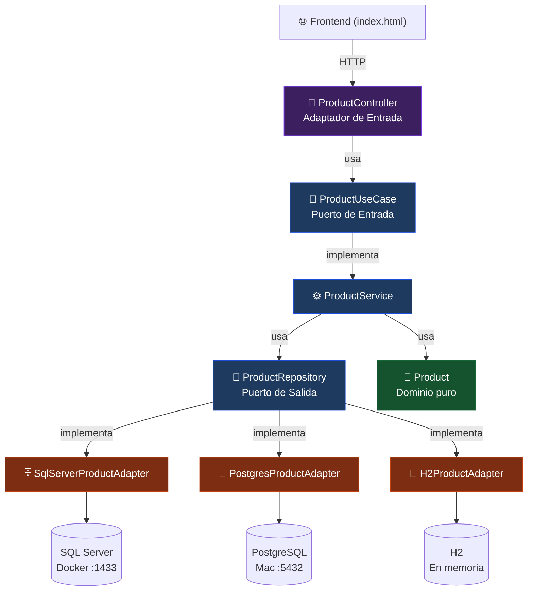
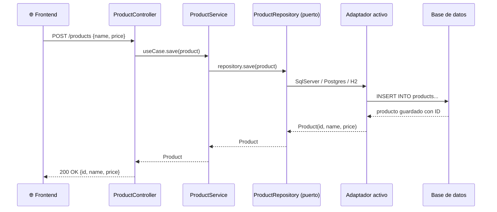
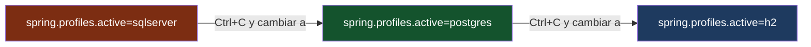

# 🔷 Arquitectura Hexagonal — Demo en Java

Demo práctica que muestra los beneficios de la arquitectura hexagonal (Ports & Adapters) usando un CRUD de productos con **3 bases de datos intercambiables** sin tocar una sola línea del dominio.

---

## ¿Qué demuestra este proyecto?

> Cambiar de **SQL Server** → **PostgreSQL** → **H2** modificando **una sola línea** de configuración.

El dominio, la lógica de negocio y el controlador REST permanecen intactos. Solo se intercambia el adaptador de persistencia.

---

## Arquitectura



---

## Estructura del proyecto

```
src/main/java/com/demo/hexagonal/
│
├── domain/                              ← 💎 Núcleo puro. Solo entidades y reglas de negocio.
│   └── model/
│       └── Product.java                 ← Entidad de negocio. Cero anotaciones de frameworks.
│
├── application/                         ← ⚙️ Casos de uso + contratos (puertos).
│   ├── port/
│   │   ├── in/
│   │   │   └── ProductUseCase.java      ← Puerto de entrada: qué puede hacer la aplicación
│   │   └── out/
│   │       └── ProductRepository.java   ← Puerto de salida: qué necesita la aplicación
│   └── ProductService.java              ← Implementa ProductUseCase, usa ProductRepository
│
└── infrastructure/                      ← 🔌 Detalles técnicos. Todo lo reemplazable.
    └── adapter/
        ├── in/
        │   └── ProductController.java       ← Adaptador REST (entrada)
        └── out/
            ├── SqlServerProductAdapter.java  ← Adaptador SQL Server (salida)
            ├── PostgresProductAdapter.java   ← Adaptador PostgreSQL (salida)
            ├── H2ProductAdapter.java         ← Adaptador H2 (salida)
            ├── ProductEntity.java            ← Entidad JPA
            ├── JpaProductRepository.java     ← Spring Data JPA
            └── PersistenceConfig.java        ← Selección de adaptador por perfil
```

---

## Flujo de una petición



---

## Requisitos

| Herramienta | Versión mínima |
|---|---|
| Java | 21+ |
| Maven | 3.9+ |
| Docker | Para SQL Server |
| PostgreSQL | Instalado en Mac (opcional) |

---

## Lanzamiento

### 1. Clonar el repositorio

```bash
git clone <url-del-repo>
cd hexagonal-demo
```

### 2. Elegir base de datos

#### 🔴 SQL Server (Docker)

Asegúrate de tener el contenedor corriendo:

```bash
docker run -e "ACCEPT_EULA=Y" -e "SA_PASSWORD=TuPassword" \
  -p 1433:1433 --name sqlserver \
  -d mcr.microsoft.com/mssql/server:2022-latest
```

Crea la base de datos:

```bash
docker exec -it sqlserver /opt/mssql-tools18/bin/sqlcmd \
  -S localhost -U sa -P 'TuPassword' \
  -Q "CREATE DATABASE hexagonal_demo;" -C
```

Edita `src/main/resources/application-sqlserver.properties` con tu password y lanza:

```bash
mvn spring-boot:run -Dspring-boot.run.profiles=sqlserver
```

---

#### 🐘 PostgreSQL (Mac nativo)

Crea la base de datos:

```bash
psql -U postgres -c "CREATE DATABASE hexagonal_demo;"
```

Edita `src/main/resources/application-postgres.properties` con tu usuario/password y lanza:

```bash
mvn spring-boot:run -Dspring-boot.run.profiles=postgres
```

---

#### 💾 H2 (sin instalación, en memoria)

No requiere ninguna configuración previa:

```bash
mvn spring-boot:run -Dspring-boot.run.profiles=h2
```

> ⚠️ Los datos se pierden al apagar la aplicación.
> Consola H2 disponible en: http://localhost:8080/h2-console

---

### 3. Abrir la interfaz gráfica

```
http://localhost:8080
```

La UI muestra en tiempo real qué base de datos está activa y permite crear, listar y eliminar productos.

---

## La demo del beneficio principal



**Archivos modificados para "migrar" de BD: 1**
**Líneas modificadas: 1**
**Cambios en dominio: 0**
**Cambios en lógica de negocio: 0**
**Cambios en el controlador REST: 0**

---

## API REST

| Método | Endpoint | Descripción |
|---|---|---|
| `GET` | `/products` | Lista todos los productos |
| `POST` | `/products` | Crea un producto |
| `DELETE` | `/products/{id}` | Elimina un producto |
| `GET` | `/active-db` | Retorna la BD activa |

### Ejemplo con curl

```bash
# Crear
curl -X POST http://localhost:8080/products \
  -H "Content-Type: application/json" \
  -d '{"name":"Laptop","price":1500.00}'

# Listar
curl http://localhost:8080/products

# Eliminar
curl -X DELETE http://localhost:8080/products/1
```

---

## ¿Por qué Arquitectura Hexagonal?

| Problema tradicional | Solución hexagonal |
|---|---|
| El dominio depende de JPA, Spring, etc. | El dominio es POJO puro, sin anotaciones |
| Cambiar de BD requiere tocar lógica | Solo se cambia el adaptador |
| Tests requieren levantar BD real | Se inyecta un adaptador en memoria |
| Difícil agregar nueva fuente de datos | Implementar `ProductRepository` y registrar el `@Bean` |

---

## Stack

- **Java 21+** con Spring Boot 3.3
- **Spring Data JPA** + Hibernate
- **SQL Server 2022** (Docker)
- **PostgreSQL** (nativo)
- **H2** (en memoria)
- **Frontend** HTML/CSS/JS vanilla servido por Spring Boot
